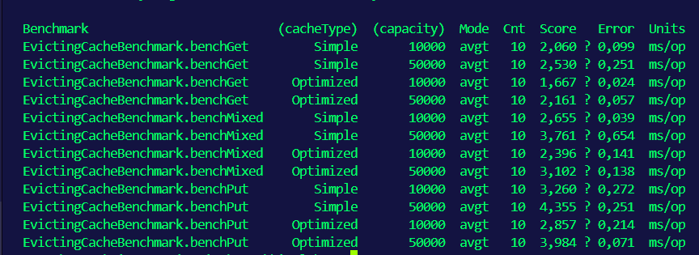
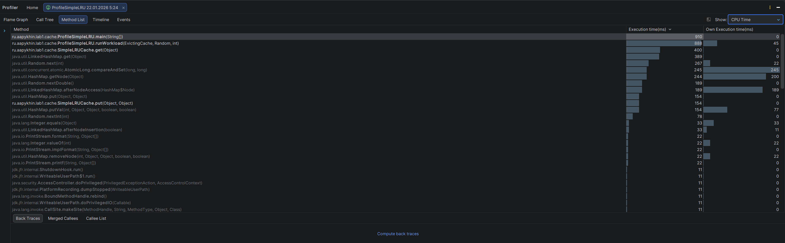
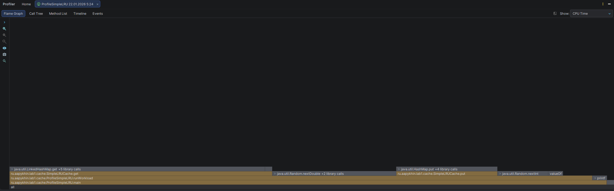
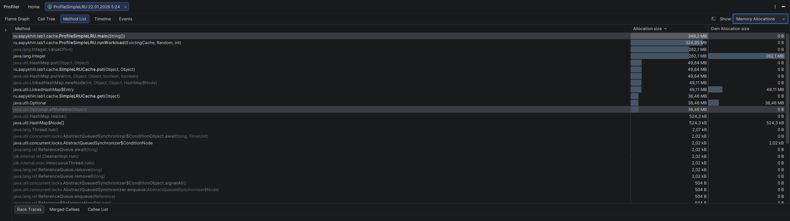
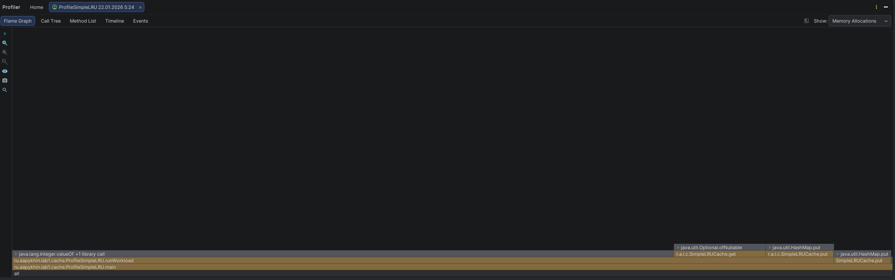
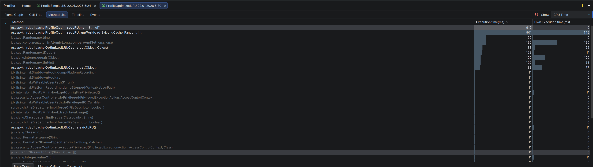
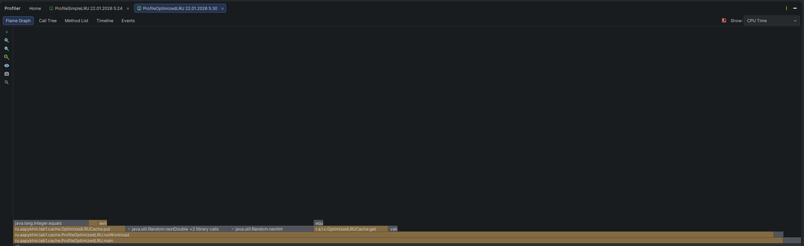
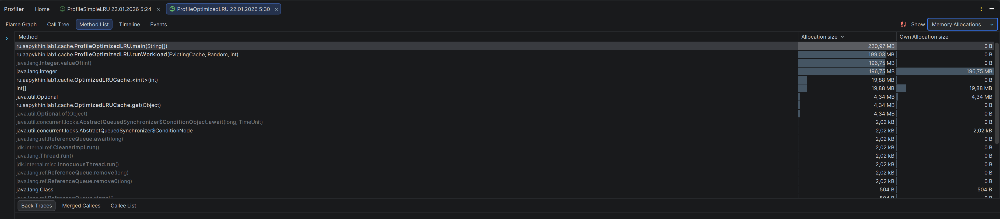
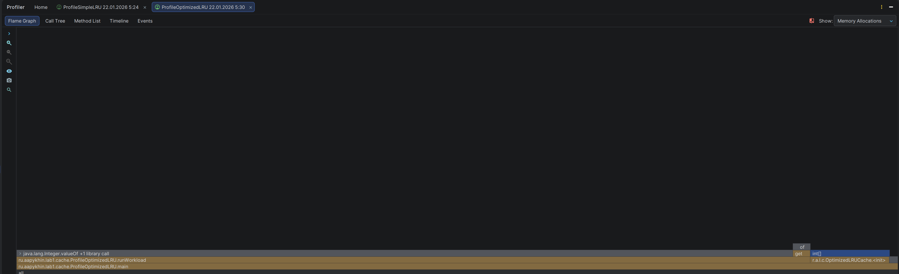

# Лабораторная работа №1: Изучение инструментов профилирования и анализа производительности java-приложений

## Структура проекта

Проект содержит две реализации LRU кэша с разными подходами к оптимизации. Исходный код находится в пакете `ru.aapykhin.lab1.cache`.

```
src/main/java/ru/aapykhin/lab1/cache/
├── EvictingCache.java           # Интерфейс кэша с вытеснением
├── SimpleLRUCache.java          # Простая реализация на LinkedHashMap
├── OptimizedLRUCache.java       # Оптимизированная реализация на массивах
├── EvictingCacheBenchmark.java  # JMH бенчмарк
├── ProfileSimpleLRU.java        # Profiler runner для SimpleLRU
└── ProfileOptimizedLRU.java     # Profiler runner для OptimizedLRU

src/test/java/ru/aapykhin/lab1/cache/
└── EvictingCacheTest.java       # Unit-тесты
```

## Описание реализаций

### SimpleLRUCache (Базовая реализация)

Простая реализация LRU кэша на основе `LinkedHashMap` с параметром `accessOrder=true`. При превышении capacity автоматически удаляется самый старый по использованию элемент через переопределённый метод `removeEldestEntry()`.

### OptimizedLRUCache (Оптимизированная реализация)

Реализация LRU кэша на параллельных массивах с ручным управлением памятью.

**Оптимизации:**
1. **Параллельные массивы** вместо объектов-обёрток — данные хранятся в примитивных массивах `keys[]`, `values[]`, `hashCodes[]`
2. **Открытая адресация** с цепочками — лучшая локальность данных в кэше CPU
3. **Битовая маска** вместо деления — `hash & tableMask` быстрее `hash % tableSize`
4. **Inline doubly-linked list** — массивы `prev[]` и `next[]` вместо объектов Node
5. **Free list** — переиспользование слотов без аллокаций

**Сложность:** O(1) для всех операций.

## Результаты JMH Benchmark

Бенчмарк измеряет среднее время выполнения 100 000 операций в миллисекундах (меньше — лучше):



| Benchmark  | Cache     | Capacity | Score (ms/op) | Error   |
|:-----------|:----------|:--------:|:-------------:|:-------:|
| benchGet   | Simple    |  10000   |     2.060     | ±0.099  |
| benchGet   | Simple    |  50000   |     2.530     | ±0.251  |
| benchGet   | Optimized |  10000   |     1.667     | ±0.024  |
| benchGet   | Optimized |  50000   |     2.161     | ±0.057  |
| benchMixed | Simple    |  10000   |     2.655     | ±0.039  |
| benchMixed | Simple    |  50000   |     3.761     | ±0.654  |
| benchMixed | Optimized |  10000   |     2.396     | ±0.141  |
| benchMixed | Optimized |  50000   |     3.102     | ±0.138  |
| benchPut   | Simple    |  10000   |     3.260     | ±0.272  |
| benchPut   | Simple    |  50000   |     4.355     | ±0.251  |
| benchPut   | Optimized |  10000   |     2.857     | ±0.214  |
| benchPut   | Optimized |  50000   |     3.984     | ±0.071  |

### Сравнение производительности

| Операция | Capacity | Simple (ms) | Optimized (ms) | Ускорение |
|:---------|:--------:|:-----------:|:--------------:|:---------:|
| get      |  10000   |    2.06     |      1.67      |  **19%**  |
| get      |  50000   |    2.53     |      2.16      |  **15%**  |
| mixed    |  10000   |    2.66     |      2.40      |  **10%**  |
| mixed    |  50000   |    3.76     |      3.10      |  **18%**  |
| put      |  10000   |    3.26     |      2.86      |  **12%**  |
| put      |  50000   |    4.36     |      3.98      |   **9%**  |

**Вывод**: OptimizedLRU в среднем на **10-19%** быстрее SimpleLRU на всех операциях.

## Результаты профилирования

Профилирование выполнено с помощью IntelliJ Profiler (10 млн операций, capacity=50000, 50% hit rate).

### SimpleLRU Cache — CPU Time



| Метод                          | Execution time (ms) | Own time (ms) |
|:-------------------------------|:-------------------:|:-------------:|
| `ProfileSimpleLRU.main`        |         898         |      45       |
| `ProfileSimpleLRU.runWorkload` |         853         |       0       |
| `SimpleLRUCache.get`           |         400         |       0       |
| `LinkedHashMap.get`            |         399         |       0       |
| `HashMap.getNode`              |         287         |      22       |
| `AtomicLong.compareAndSet`     |         244         |      200      |
| `SimpleLRUCache.put`           |         154         |       0       |

**Flame Graph (CPU Time):**



### SimpleLRU Cache — Memory Allocations



| Источник                 | Allocation size |
|:-------------------------|:---------------:|
| `ProfileSimpleLRU.main`  |    349.21 MB    |
| `Integer.valueOf`        |    182.1 MB     |
| `SimpleLRUCache.put`     |    262.1 MB     |
| `Optional.of`            |    36.46 MB     |
| `LinkedHashMap$Entry`    |    49.11 MB     |

**Flame Graph (Memory Allocations):**



---

### OptimizedLRU Cache — CPU Time



| Метод                             | Execution time (ms) | Own time (ms) |
|:----------------------------------|:-------------------:|:-------------:|
| `ProfileOptimizedLRU.main`        |         901         |      446      |
| `ProfileOptimizedLRU.runWorkload` |         455         |       0       |
| `Random.nextInt`                  |         190         |       0       |
| `OptimizedLRUCache.put`           |         133         |      22       |
| `Integer.equals`                  |         100         |      100      |
| `OptimizedLRUCache.get`           |         100         |      22       |

**Flame Graph (CPU Time):**



### OptimizedLRU Cache — Memory Allocations



| Источник                   | Allocation size |
|:---------------------------|:---------------:|
| `ProfileOptimizedLRU.main` |    220.07 MB    |
| `Integer.valueOf`          |    186.75 MB    |
| `OptimizedLRUCache.<init>` |    19.88 MB     |
| `Optional.of`              |     4.34 MB     |

**Flame Graph (Memory Allocations):**



---

### Сравнение Memory Allocations

| Источник                       |  SimpleLRU  | OptimizedLRU |  Разница  |
|:-------------------------------|:-----------:|:------------:|:---------:|
| **Общий объём**                | 349.21 MB   |  220.07 MB   | **-37%**  |
| `Integer.valueOf` (autoboxing) | 182.1 MB    |  186.75 MB   |    +2%    |
| `Optional.of`                  | 36.46 MB    |   4.34 MB    | **-88%**  |
| Структуры данных кэша          | 49.11 MB    |  19.88 MB    | **-60%**  |

**Ключевые наблюдения:**
- OptimizedLRU аллоцирует на **37% меньше памяти**
- Основная экономия — отсутствие `LinkedHashMap$Entry` объектов
- `Optional.of` вызывается реже благодаря `Optional.empty()` для промахов
- Autoboxing `Integer.valueOf` остаётся основным источником аллокаций в обеих реализациях

## Анализ результатов

### Почему OptimizedLRU быстрее?

1. **Меньше indirection**
   - SimpleLRU: `map.get(key)` → `HashMap.getNode()` → `LinkedHashMap.Entry`
   - OptimizedLRU: `table[bucket]` → `keys[slot]` (прямой доступ к массивам)

2. **Лучшая cache locality**
   - Параллельные массивы `keys[]`, `values[]`, `hashCodes[]` располагаются последовательно в памяти
   - CPU prefetcher эффективнее работает с массивами, чем с разбросанными объектами

3. **Меньше аллокаций**
   - SimpleLRU создаёт `LinkedHashMap$Entry` при каждом `put()`
   - OptimizedLRU переиспользует слоты через free list

4. **Битовая маска vs модуль**
   - `hash & tableMask` — одна инструкция AND
   - `hash % tableSize` — деление, значительно медленнее

## Вывод

Проведённая работа демонстрирует, что ручная оптимизация структур данных может дать существенный прирост производительности. OptimizedLRU Cache на **10-19% быстрее** и потребляет на **37% меньше памяти** по сравнению с SimpleLRU Cache.

Ключевые факторы оптимизации:
1. **Параллельные массивы** вместо объектов — улучшает cache locality и снижает GC pressure
2. **Free list** для переиспользования слотов — избегает аллокаций при вытеснении
3. **Битовая маска** вместо модуля — ускоряет вычисление индекса бакета
